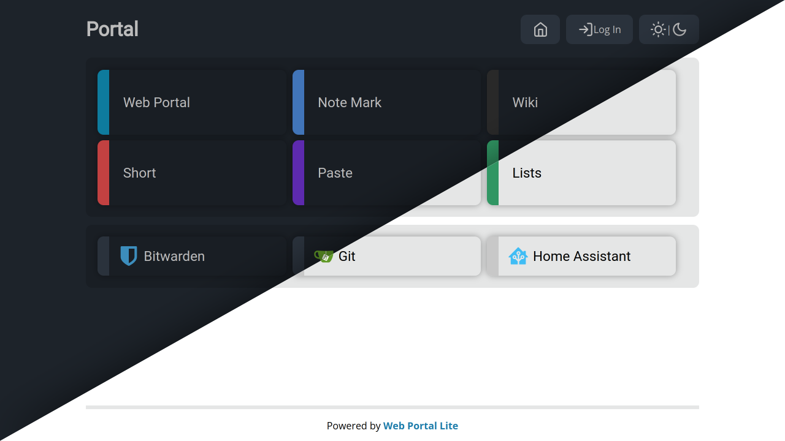

# Web Portal Lite

Web Portal Lite is a web dashboard to manage a page of links. It offers a minimal feature set to the feature rich [Web Portal](https://github.com/enchant97/web-portal). Designed for users who just want to create a fancy looking links page and not worry about the advanced features.

It has been designed to run through docker and it is recommended to put it behind a proxy like Nginx for custom routing and domain names.

## Features
- Access a grid of beautiful links to your web services
- Works without JavaScript, to provide a lightning fast experience
- Customise dashboard through a basic yaml file (no database needed)
- Wide range of link colors (or no color)
- Provide your own app icons for links
- Create groups of links
- Optionally secure the portal with user accounts
- Icon based theme
- Dark/Light mode
- Lightweight Docker image

## Showcase

## Docs
Docs are located in the [/docs](docs/index.md) directory or at: <https://enchantedcode.co.uk/web-portal-lite/>.

## License
This project is Copyright (c) 2023 Leo Spratt, licences shown below:

Code

    AGPL-3 or any later version. Full license found in `LICENSE.txt`

Documentation

    FDLv1.3 or any later version. Full license found in `docs/LICENSE.txt`

This project also uses some third party content, licences for those are found at: `THIRD-PARTY.txt`.
